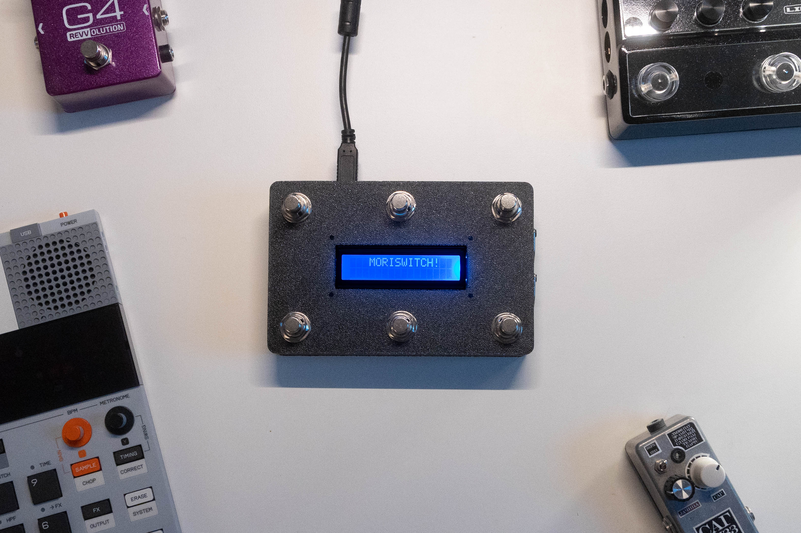
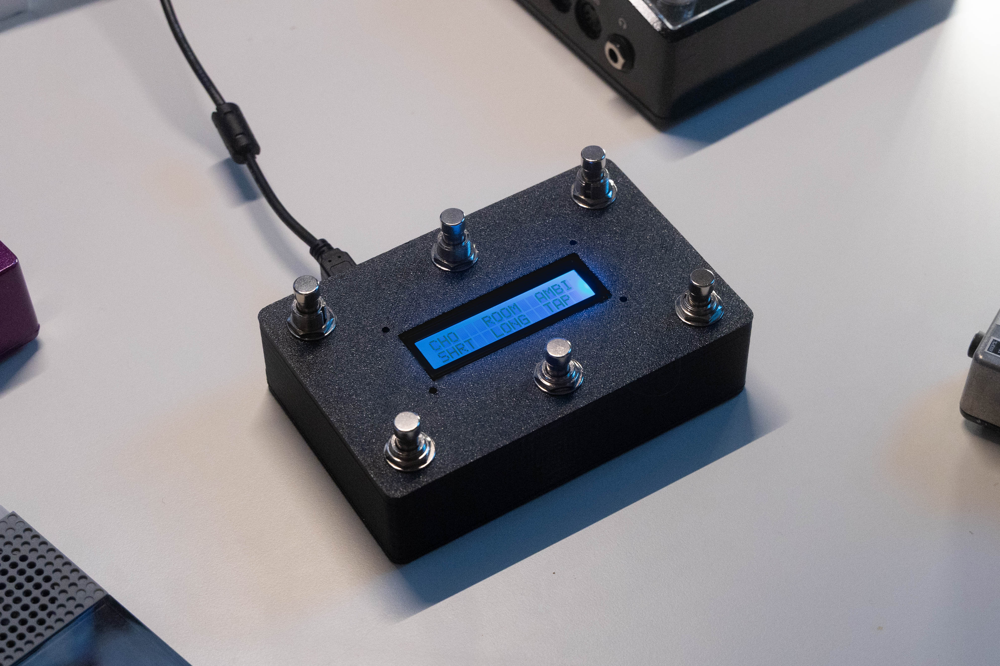
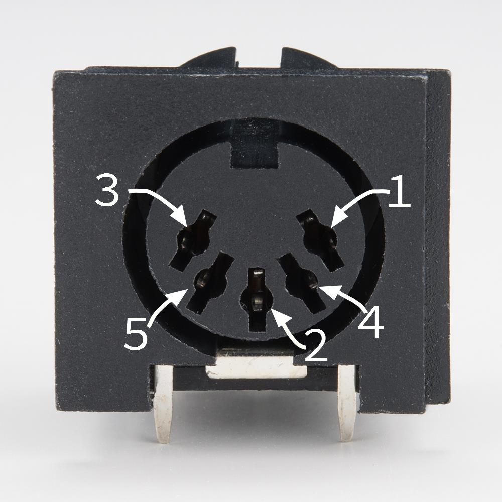

<p align="left">
  
</p>


<p align="left">
  
</p>

> A Configurable, fully open-source MIDI foot controller platform designed for musicians who want full control over their setup.


## Context

Hello, fellow musicians! 👻

There are many DIY microcontroller-based MIDI controller projects designed to control MIDI-based music equipment. However, most of these projects rely on code-based configuration, making it difficult to quickly modify MIDI parameters. In addition, structured bank systems are often missing or limited, reducing flexibility during live performance. 

Moriswitch was created to address these limitations by introducing a configurable architecture, a flexible bank system, and a web-based interface that allows users to modify behavior without changing the firmware.

You can use many different 3D models in the repository to quickly print enclosures to build your own Moriswitch, or make your own unique enclosure out of Hammond enclosures, wood, empty pill box, or even cardboard!

If you make one with a 1602 I2C display, you can see the functions of the footswitches right on the LCD.

<p align="left">
  
</p>

## Functions
Moriswitch is a standalone MIDI foot controller capable of sending MIDI CC and PC messages across all 16 MIDI channels. It is primarily designed for controlling MIDI-enabled guitar pedalboards.

With ATmega32U4-based Arduino boards (or teensy 3.x /4.x), Moriswitch can also operate as a USB MIDI device. This enables direct integration with DAWs and software environments such as Ableton Live, MainStage, Loopy Pro, etc.

You can program individual footswitches with desired MIDI CC or PC values with the web editor, which is available in https://sthubb.github.io/MORISWITCH/

## Hardware Requirements
- Arduino board with ATmega32U4 (ex. Arduino Leonardo, Pro Micro) or Teensy 3.x, 4.x
- DC input jack and DC step down buck converter (9V to 5V) * this is not required if you are only using USB bus power. However, I highly recommend using this if you are using Moriswitch with your standard guitar pedal power supply.
- [x6 (recommended) Momentary SPST Footswitch](https://ko.aliexpress.com/item/1005004646906063.html?spm=a2g0o.productlist.main.15.11081ed37DtXsB&algo_pvid=f7af22fd-a6c7-4cbd-9302-b6cd93ec2bb8&algo_exp_id=f7af22fd-a6c7-4cbd-9302-b6cd93ec2bb8-14&pdp_ext_f=%7B%22order%22%3A%22339%22%2C%22eval%22%3A%221%22%2C%22fromPage%22%3A%22search%22%7D&pdp_npi=6%40dis%21KRW%2126973%2115367%21%21%2117.36%219.89%21%402102f0cc17742572339856801e5355%2112000029966854733%21sea%21KR%210%21ABX%211%210%21n_tag%3A-29910%3Bd%3Ada32f33b%3Bm03_new_user%3A-29895%3BpisId%3A5000000201545898&curPageLogUid=dLw7PkuSQgi7&utparam-url=scene%3Asearch%7Cquery_from%3A%7Cx_object_id%3A1005004646906063%7C_p_origin_prod%3A)
- [Panel mounted USB-B or USB-C to Micro USB extension cable](https://ko.aliexpress.com/item/4001339369193.html?spm=a2g0o.productlist.main.1.1a4cNl4ANl4ALl&algo_pvid=d0e3c9d2-1e0f-4b8f-861b-d6604360429e&algo_exp_id=d0e3c9d2-1e0f-4b8f-861b-d6604360429e-0&pdp_ext_f=%7B%22order%22%3A%22193%22%2C%22eval%22%3A%221%22%2C%22fromPage%22%3A%22search%22%7D&pdp_npi=6%40dis%21KRW%214480%214480%21%21%212.88%212.88%21%400b1bf20a17742599804656112e042c%2110000015736136090%21sea%21KR%210%21ABX%211%210%21n_tag%3A-29910%3Bd%3Ada32f33b%3Bm03_new_user%3A-29895&curPageLogUid=RKfiY8mMOpBr&utparam-url=scene%3Asearch%7Cquery_from%3A%7Cx_object_id%3A4001339369193%7C_p_origin_prod%3A)
- [Female 5Pin MIDI-DIN Port](https://ko.aliexpress.com/item/4000583940302.html?spm=a2g0o.productlist.main.21.372b457D457DHX&algo_pvid=42900f3e-be00-459a-9aab-9cbd49aead91&algo_exp_id=42900f3e-be00-459a-9aab-9cbd49aead91-20&pdp_ext_f=%7B%22order%22%3A%22814%22%2C%22eval%22%3A%221%22%2C%22fromPage%22%3A%22search%22%7D&pdp_npi=6%40dis%21KRW%212874%211243%21%21%211.85%210.80%21%402141115b17742600113885236e8070%2110000003419026890%21sea%21KR%210%21ABX%211%210%21n_tag%3A-29910%3Bd%3Ada32f33b%3Bm03_new_user%3A-29895%3BpisId%3A5000000201545898&curPageLogUid=dDupSolANisD&utparam-url=scene%3Asearch%7Cquery_from%3A%7Cx_object_id%3A4000583940302%7C_p_origin_prod%3A) and x2 220Ω resistors
- (optional) LCD compatible with mainboard ([I2C](https://ko.aliexpress.com/item/1005006964073869.html?spm=a2g0o.productlist.main.3.29452d1ftEgVnx&algo_pvid=31f5d965-e20a-4f2f-aa67-998d3429ac63&algo_exp_id=31f5d965-e20a-4f2f-aa67-998d3429ac63-2&pdp_ext_f=%7B%22order%22%3A%226164%22%2C%22eval%22%3A%221%22%2C%22fromPage%22%3A%22search%22%7D&pdp_npi=6%40dis%21KRW%211880%211243%21%21%211.21%210.80%21%40212a6e3217742600338238187ec9b6%2112000038877067798%21sea%21KR%210%21ABX%211%210%21n_tag%3A-29910%3Bd%3Ada32f33b%3Bm03_new_user%3A-29895%3BpisId%3A5000000201545900&curPageLogUid=v729dtakixUR&utparam-url=scene%3Asearch%7Cquery_from%3A%7Cx_object_id%3A1005006964073869%7C_p_origin_prod%3A) recommended)

## Installation

### 1. Uploading code

- Use your Arduino IDE and connect your Arduino board. Download and open MORISWITCH ino file on the IDE, and upload the code into the board.

### 2. Construction

- Choose your desired enclosure for the build. If you have a 3D printer, you can directly print out STL files on the repository or edit these files for your desired design on Fusion 360. If you don't want to use plastics on your build, you can always make your own desired enclosure using anything.
- Wire all footswitches to share a common ground. This can be done by daisy-chaining the ground connections, as the microcontroller detects a button press when a pin is connected to GND.
- Now you should wire the other pin on your SPST switches to the microcontroller. You have to be careful and choose what pins you are going to use for your footswitches.
- For Arduino Leonardo, you have 13 digital pins and separate SDA/SCL pins. However, you need TX/RX pins for MIDI communications, so try to avoid those pins. My recommendation is to use pins D5-D10.
- For Arduino Pro Micro, on the other hand, you only have 12 digital pins and pin D2 and D3 are reserved for SDA/SCL which is crucial for I2C communication. My recommendation is to use pins D5-D10.
- You can configure these pins on the ino file. If you accidentally wire these pins incorrectly, you can edit this line and make it function properly. For your information, SW1 is the top left, and SW6 is the bottom right.
  
  ```C++
  const uint8_t switchPins[NUM_SW] = {5, 6, 7, 8, 9, 10}; // SW1..SW6
  ```
- Set your buck converter to send 5V DC. Connect the output to your mainboard, and input to the DC input jack.
- Now you need to solder the Arduino TX pin to the MIDI DIN port. This is the pin number on MIDI ports.
  <p align="left">
    
  </p>
  This can be confusing, so just focus on the labeled pin numbers.
  
  - Arduino TX pin -> 220Ohm Resistor -> DIN pin 5
  - DC 5V -> 220Ohm Resistor -> DIN pin 4
  - GND -> DIN pin 2

- Connect your USB extension cable, and now you are ready to set it up!

### 3. Setting Up

- Now, the best part about Moriswitch is the editor. It fully supports serial connection with the device via a web browser. I recommend Chromium based browsers because they support USB-serial connection. Safari does not support this connection, so it can't communicate with the switch itself.
- go to https://sthubb.github.io/MORISWITCH/ . You will see a Connect button on the top right end. Press it, and you will see serial port window asking you to choose a device. You should choose the Arduino from that window.
- Now you can configure all the switches with your desired functions. Configure it as you wish, and whenever you want to edit the configuration, you can press the Load button to retrieve your configuration.
- You can natively scroll through banks by pressing SW4 + SW5 (Bank Down), or SW5 + SW6 (Bank Up). You can configure dedicated footswitches to scroll through banks by assigning "BANK UP" or "BANK DOWN" function from the editor. 
  
- There are few MIDI message variants.
  - Standard CC mode sends CC value when pressed, and also sends value when released. This is used for most of the standard MIDI devices. However, some pedals pedals only want to receive single MIDI message at press.
  - This is where CC (One Shot) is used. This function sends only one CC value when it is pressed. 
  - CC (Toggle) mode is designed for pedals that receive different CC velocity values when sending same CC values. For example, On the Line 6 HX Stomp, sending a CC velocity value of 0 will bypass the effect block, and CC velocity of 127 will turn the effect on.
 
- The 1602 LCD will display the function of each footswitch in 6 switch configuration. Each label can be up to 4 characters long.

- If you need to quickly change values, you can always press the switch you want to edit for 2 seconds, an on-device editor will pop up where you can edit the CC values, switch types and most of the variables. Press Switch 3 to navigate between pages, and when you are done editing, press Switch 6 to save and exit.
  
  <p align="left">
    
  </p>

## Development

I am currently working on a MIDI clock feature, but integrating it into Moriswitch is still uncertain due to challenges in achieving accurate tap tempo calculation. I will continue improving the project and adding new features as development progresses.

If you have any ideas, feature requests, or suggestions, feel free to open an issue or contribute to the project. Contributions are welcome, but all changes are reviewed before merging.

Thank you for your interest in this project!

## Releases

v0.1.0 - Initial release with basic bank system (up to 12 banks)

v0.2.0 - Added CC Toggle mode

v0.3.0 - Added Web-based Online Editor

v1.0.0 - Stable release with full configuration system

v1.1.0 - Added on-device editor. Updated chord press logic to be more efficient.

v1.2.0 - Added MIDIUSB support.
